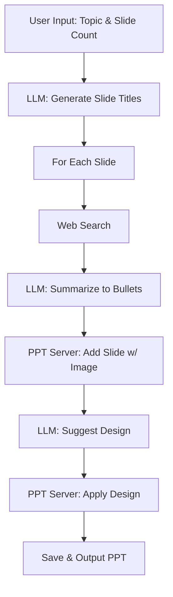
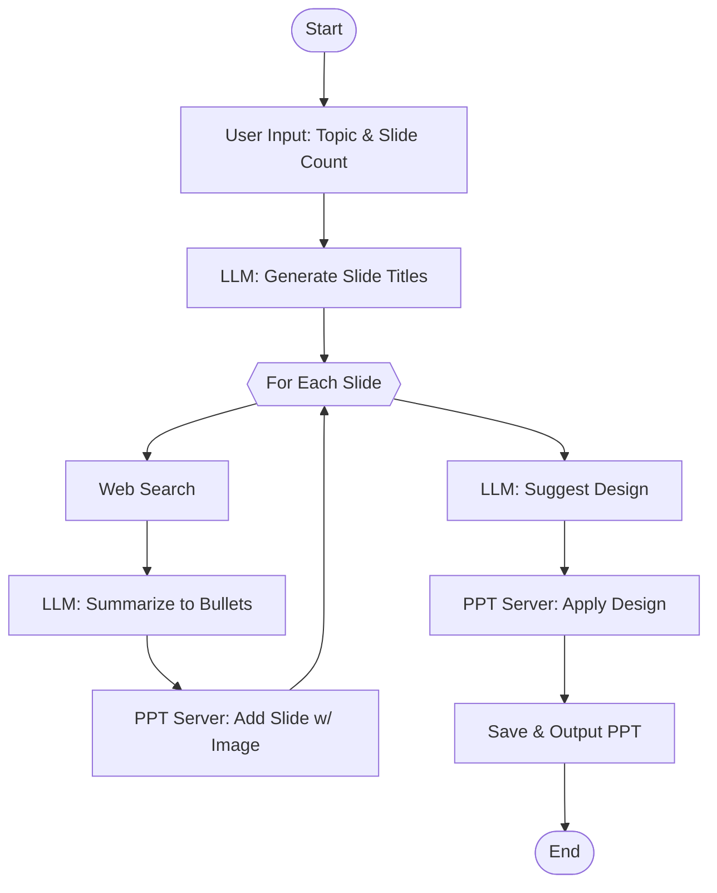

# PPT__Agent

A fully automated, AI-powered PowerPoint generation system that creates visually appealing, content-rich presentations from a single topic prompt. The project leverages LLMs, web search, and dynamic design suggestions to generate professional PPTs with minimal user input.

---

## 🚀 Overview
PPT__Agent is a multi-server, multi-tool system that:
- Accepts a topic and slide count from the user
- Plans slide titles using an LLM
- Gathers content via web search and LLM summarization
- Dynamically generates slide bullet points
- Suggests and applies a unique design theme for each presentation
- Assembles and saves a complete PowerPoint file, including relevant images

---

## 🏗️ Architecture Diagram



---

## 🧩 Component Table

| Component         | Description                                                                 | Key Tools/Functions                |
|-------------------|-----------------------------------------------------------------------------|------------------------------------|
| **mcp_client.py** | Orchestrates the workflow, interacts with LLMs, coordinates all tools/servers| Slide planning, content, design    |
| **ppt_server.py** | Handles PowerPoint creation, slide addition, image insertion, design         | create_presentation, add_slide_with_image, design_ppt, save_presentation |
| **search_server.py** | Handles web search queries to enrich slide content (assumed)              | search_web                         |
| **config.py**     | Stores API keys and configuration                                            | -                                  |
| **frontend/**     | (Optional) UI for user interaction                                          | -                                  |

---

## 🛠️ Tools Table

| Server         | Tool Name              | Purpose                                                      |
|----------------|-----------------------|--------------------------------------------------------------|
| ppt_server     | create_presentation   | Initializes a new PPT file                                   |
| ppt_server     | add_slide_with_image  | Adds a slide with title, bullets, and a relevant image       |
| ppt_server     | add_slide             | Adds a slide with title and bullets (no image)               |
| ppt_server     | design_ppt            | Applies a design theme to the PPT (background, font, colors) |
| ppt_server     | save_presentation     | Saves the PPT to disk                                        |
| search_server  | search_web            | Performs web search for slide content enrichment             |

---

## ⚙️ Workflow Table

| Step | Action                                      | Responsible Component/Tool         |
|------|---------------------------------------------|------------------------------------|
| 1    | User provides topic and slide count         | mcp_client.py                      |
| 2    | LLM generates slide titles                  | mcp_client.py (LLM)                |
| 3    | For each slide: web search                  | search_server.py (search_web)      |
| 4    | LLM summarizes to bullet points             | mcp_client.py (LLM)                |
| 5    | Add slide with image                        | ppt_server.py (add_slide_with_image)|
| 6    | LLM suggests design theme                   | mcp_client.py (LLM)                |
| 7    | Apply design to all slides                  | ppt_server.py (design_ppt)         |
| 8    | Save final PPT                              | ppt_server.py (save_presentation)  |

---

## 🔄 Detailed Flowchart



---

## 🖥️ Demo Video
[Watch the code explanation + demo here (10min video)](https://1drv.ms/v/c/75e01f03144d2386/IQBpT1PncEtVQbxp1IcXz3Y5AQhS8_namSxjOSYrgJY3eiE?e=Whp2tI) <!-- Replace # with your video link -->

[Watch the 2 min demo here](https://1drv.ms/v/c/75e01f03144d2386/IQADHibZlcluTrui5cIcGJMFASmSC9_HRnUj4k1XGpJJulU?e=Oe86x4) <!-- Replace # with your video link -->

---

## 📂 Project Structure

```
PPT__Agent/
├── backend/
│   ├── app.py
│   ├── ppt_server.py
│   ├── search_server.py
│   ├── mcp_client.py
│   ├── config.py
│   ├── find_path.py
│   ├── requirements.txt
│   └── ...
├── frontend/
│   ├── src/
│   ├── public/
│   ├── package.json
│   └── ...
└── README.md
```

---

## 📝 Notes
- All LLM prompts and design logic are fully customizable
- The system is modular: add/remove tools and servers as needed
- For best results, use a high-quality LLM and image API

---

## 📧 Contact
For questions, suggestions, or contributions, please open an issue or contact the maintainer.
